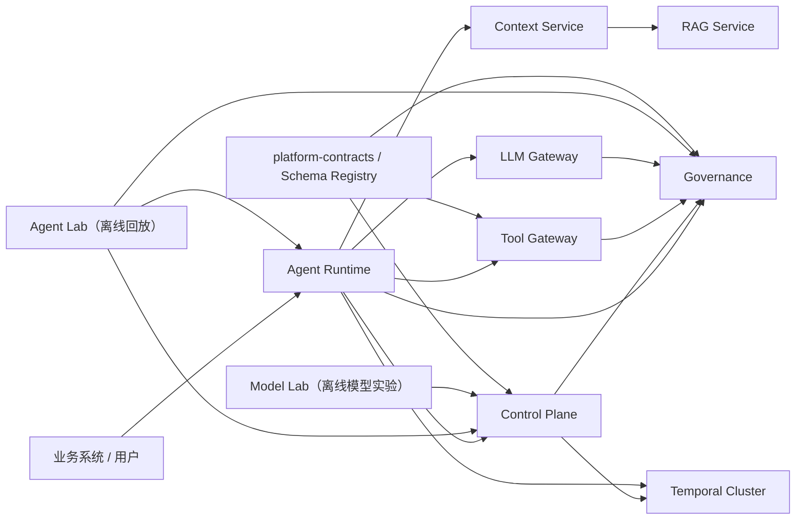

# Agent Platform

> 文档状态：本 README 提供快速入口；以 [架构总览](docs/architecture-overview.md) 和
> [部署指南](docs/deployment-guide.md) 作为当前服务边界、实验链路与部署条件的权威说明。

> 定位：这是一个面向企业知识问答、受控业务自动化与合规审计的 Agent Platform。它不是把模型、
> 工具和业务数据放进同一个应用的 Demo，而是将“定义、发布、执行、数据访问、模型访问、工具副作用、
> 评测审计”拆成可独立治理和部署的边界。

## 你可以用它做什么

- 发布多个业务域 Agent：它们共享 Runtime、Gateway 和治理能力，但拥有不同的知识源、工具、权限、
  数据域、预算、审批与发布节奏；
- 将一次用户请求编译为受限执行计划：模型只能在发布快照允许的 Graph、模型、知识和工具范围内行动；
- 对知识检索、模型调用和工具副作用建立统一的身份、成本、审计和故障恢复链路；
- 以 Agent Lab 回放冻结快照，以 Governance 质量门禁控制正式 Release，以 Model Lab 管理可选自部署模型实验；
- 由 Temporal 承载跨天、审批等待、重试和故障恢复，不把长期任务留在 Web 请求或单个 Python 进程中。

## 核心设计原则

| 原则 | 在代码中的含义 |
| --- | --- |
| 发布态不可变 | Draft 可编辑；Spec 经校验；Release 生成带摘要的 `runtime-snapshot/v1`，Runtime 不解释草稿。 |
| 默认拒绝 | 缺少快照、工具版本、能力 Provider、目标集群证明、OIDC/mTLS 或审批时均拒绝，不做隐式回退。 |
| 服务边界优先 | Runtime 只经 `platform-sdk` 的 HTTP/契约访问 Context、RAG、LLM、Tool，不 import 其他应用包。 |
| 模型无特权 | 模型只能提出动作；Graph、预算、Workflow DSL、Tool Gateway 与审批链路决定是否真的执行。 |
| 一份事实，多种投影 | Run、Session、Outbox、Trace 使用关联 ID 串联；审计与回放从已提交事实派生，不依赖内存回调。 |
| 实验与生产分离 | Model Lab 与 Agent Lab 可试验、回放和评估；Control Plane 才能正式发布，Runtime 不承担实验平台职责。 |

## 阅读路线

1. 第一次了解平台：阅读本文的“架构总览”“生命周期”和“服务目录”。
2. 理解线上执行：阅读 [Agent Runtime](agent-runtime/README.md) 与 [架构总览](docs/architecture-overview.md)。
3. 理解发布与质量：阅读 `agent-control-plane/README.md`、`agent-governance/README.md` 与 `agent-lab/README.md`。
4. 准备部署：阅读 [部署指南](docs/deployment-guide.md)，再检查 `compose.production.yaml`、证书、OIDC 与 Kafka Connect 配置。
5. 开发跨服务功能：先修改 `platform-contracts/` 或 `platform-sdk/` 中的版本化契约，再改各服务实现。

## 离线实验服务

`model-lab` 是离线模型实验服务：登记可复现的 LoRA/QLoRA、DPO/GRPO、分布式训练计划、
评测结果与模型卡。只有通过评测的模型工件才可由 Control Plane 作为 Ollama/vLLM 路由候选。

`agent-lab` 是离线 Agent 回放编排服务：冻结 Control Plane 发布快照，对受限用例调用 Agent
Runtime，并将 Judge 与质量门禁委托给 Governance。它不训练模型、不承接线上用户流量，也不直接
发布 Agent；Control Plane 只接受其已通过门禁的 release evidence。详见
[Agent Lab](agent-lab/README.md)。

RAG ingestion treats image OCR as labelled derived evidence: it is searchable,
but keeps provenance and visual-review metadata while the original artifact
remains authoritative.

## CDC event delivery

Production audit events use PostgreSQL Transactional Outbox plus Debezium/Kafka
Connect.  The business services write only their local transaction; the
`debezium-register` deployment job upserts and verifies the connector, and
Governance consumes the canonical Kafka topic with idempotency and DLQ handling.
部署变量、Debezium Connector 注册与上线检查请参阅
[部署指南](docs/deployment-guide.md)。

面向企业知识问答、受控业务自动化和合规审计的多服务 Agent 平台。仓库采用 monorepo
组织共享契约、部署文件和联调脚本；运行时仍保持明确的服务边界，因此可以按负载、数据域和
合规等级独立部署与扩缩容。

平台不把“Agent”视为可以任意调用模型和工具的聊天程序，而是将一次运行约束为：由已发布
的不可变快照定义能力，经过身份验证、上下文预算、检索、模型决策、工具审批和审计事件的
可追踪执行过程。

## 架构总览



## 七个逻辑服务

| 服务 | 核心职责 | 明确不负责 | 主要代码位置 |
| --- | --- | --- | --- |
| Control Plane | 定义 Agent、版本、发布、发布快照、质量门禁与发布编排 | 在线执行 Agent Loop | `agent-control-plane/` |
| Agent Runtime | 状态机、LangGraph、Harness、规划、预算、审批恢复与运行编排 | 直接管理业务数据或模型厂商协议 | `agent-runtime/` |
| Context Service | 会话记忆、证据组织、角色/时间/相关性/可信度排序、Token 预算 | 直接执行业务副作用 | `rag-agent-service/apps/agent_context_service/` |
| RAG Service | 文档摄取、索引、ACL 检索、混合召回、重排和证据返回 | 决定 Agent 的下一步动作 | `rag-agent-service/apps/rag_query_api/`、`apps/ingestion_*` |
| LLM Gateway | 多供应商调用、模型路由、限流、熔断、成本与模型策略 | 管理业务流程和工具权限 | `llm-gateway/` |
| Tool Gateway | 工具目录、参数校验、权限、审批、幂等与安全执行 | 让模型绕过治理直接访问业务系统 | `tool-gateway/` |
| Governance | 审计、评测、合规工作流、问题发现与不可变证据 | 同步阻塞主业务流程 | `agent-governance/` |

`model-lab/` 与 `agent-lab/` 是两个离线服务，不计入七个线上逻辑服务：前者研究模型训练与
模型卡，后者研究 Agent 快照回放、失败样本与基线比较。

## 仓库目录导航

```text
agent/
├─ agent-control-plane/    Agent Draft、Version、Release、Snapshot Compiler、发布 Saga
├─ agent-runtime/          Harness、Planner、LangGraph、Temporal Worker、Session/Run 状态
├─ rag-agent-service/      Context、RAG Query、Ingestion API/Worker、索引与文档证据
├─ llm-gateway/            Java LLM 路由、供应商适配、限流、成本与模型治理执行
├─ tool-gateway/           版本化工具目录、鉴权、审批、幂等、重试与安全调用
├─ agent-governance/       事件消费、评测、Judge 校准、审计与合规规则
├─ agent-lab/              冻结快照离线回放、基线比较、实验发布证据
├─ model-lab/              模型实验登记、模型卡、评测与可选训练工件
├─ platform-sdk/           Python 跨服务契约、HTTP Client、错误、脱敏与 Trace 传播
├─ platform-infra/         OIDC/mTLS、OPA、PostgreSQL、Telemetry、Schema/S3 适配器
├─ platform-contracts/     JSON Schema、事件与工具目录契约
├─ deploy/                 Kafka Connect、证书、部署辅助文件
└─ docs/                   架构、部署、服务拆分和工程教程
```

共享基础目录的使用规则：

- `platform-contracts/`：定义跨语言 JSON Schema、执行上下文和错误协议；变更必须版本化。
- `platform-sdk/`：Python 服务唯一可复用的调用与安全依赖；不得包含某个服务的业务仓储实现。
- `platform-infra/`：身份、网络安全、策略、遥测和存储适配；不得嵌入 Agent 业务规则。
- `compose.platform.yaml`：开发联调拓扑；`compose.production.yaml`：生产配置模板，不是 HA 验收结论。

## 一次 Agent 运行的生命周期

1. 调用方携带 OIDC Token 进入 Runtime。身份中间件验证 JWT，并从权限声明重建内部身份
   Header；业务代码不会信任调用方自行伪造的权限 Header。
2. Runtime 向 Control Plane 解析 Agent 发布版本，取得不可变发布快照。快照包含模型、知识源、
   工具版本、预算、审批和输出约束。
3. Control Plane 在发布事务内将快照编译为带内容哈希的 `runtime-snapshot/v1` Artifact；Runtime 只加载
   并校验该 Artifact。Snapshot Compiler 产出执行契约和受限 `workflow-policy/v1`；配置不完整、未知节点类型、
   非法节点迁移、能力越权或工具版本不存在时在运行前失败。发布 Graph 只能声明受控迁移，不能上传
   任意代码。
4. Context Service 读取会话消息，并按角色、时间、相关性与来源可信度进行排序。需要知识时调用
   RAG Service；若检索被声明为可选且不可用，则显式标记为 `memory-only` 降级。
5. Runtime 在启动期冻结 Context、LLM、RAG、Tool、Workflow、Session、SubAgent 与可选 Sandbox/Code
   Runner Provider；每项 Provider 以 Capability Manifest 声明契约、工件摘要、隔离级别和执行器兼容性。
   Snapshot Compiler 从发布 Spec 推导必需能力，Harness 会在选执行器前拒绝“快照需要、目标实例未部署”
   或 Manifest/Profile 不兼容的组合。随后
   Harness 解析 Release、加载 Artifact、创建执行上下文并按已部署的 Profile 选择执行器。短任务使用
   `simple/v1`，默认 Agent Loop 使用 `declarative-langgraph/v1`，长期可靠任务使用 `temporal-workflow/v1`。
   后两者由 LangGraph 在发布计划允许范围内循环规划、决策、检索、调用工具和观察；Harness 不承载这些业务能力。
6. Runtime 在状态成功提交后发布进程内生命周期事件，并以固定 Hook 阶段拦截 Prompt、模型和工具操作；
   Session Event Store 会保存脱敏、限长的模型可见投影及原文摘要，用于解释 Prompt 与回放受限上下文，
   不复制原始敏感正文。可靠事件仍经 Transactional Outbox、CDC/Kafka Connect 进入
   Governance，因而观测订阅失败不会影响用户运行。
7. Runtime 同一事务还会写入按 `(tenant_id, session_id, sequence)` 单调递增的 Session Event Store。
   Agent Lab 可分页读取该事件流来关联冻结快照、离线回放和模型决策；Context Service 仍是原始历史
   消息与上下文证据的唯一所有者，二者不会互相复制。
8. LLM Gateway 负责实际模型调用与路由。Tool Gateway 负责工具输入/输出 Schema、租户、权限、
   风险审批、一次性消费和幂等键。
9. `controlled_scan` 只可扫描预注册范围内的日志、源码或文本文件；结果会脱敏、截断，并在进入
   Prompt 前应用内容上限。
10. Runtime、Control Plane、Tool Gateway 和 LLM Gateway 通过 Outbox/事件向 Governance 写入审计。
   Governance 的评测与合规处理异步进行，不会把主运行链路变成同步依赖。

## Harness、Executor 与 Capability 的边界

Harness 是 Runtime 的最小统一执行门面，仅负责七件事：

```text
resolveRelease → loadSnapshot → createExecutionContext → resolveExecutor
      → run → resume → cancel
```

它不包含 Intent 识别、检索、Prompt 组装、模型路由、工具鉴权或业务逻辑。它们分别由 Planner、
Context/RAG、Graph/Prompt Assembly、LLM Gateway、Tool Gateway 和业务 Agent Spec 承担。

| Executor Profile | 使用场景 | 运行方式 | 关键约束 |
| --- | --- | --- | --- |
| `simple/v1` | 极短、无外部依赖任务 | 单次受限执行 | 不支持审批恢复，不加载 RAG/LLM/Tool。 |
| `declarative-langgraph/v1` | 常规 Agent 决策与工具循环 | LangGraph 检查点状态机 | 只能走已发布 Workflow DSL，模型不能加节点或改边。 |
| `temporal-workflow/v1` | 跨天任务、审批等待、外部回调 | Temporal Workflow + Runtime Worker | 只能经异步 `/runs` 提交；恢复使用 Signal 与同一检查点。 |
| `code-runner/v1` | 研发类受控代码分析 | LangGraph + 远端受限工具 | 默认关闭，要求 Sandbox/Code Runner Manifest 与固定工具版本。 |

每个 Runtime Provider 都以 `CapabilityManifest` 声明 `capability`、`provider_id`、契约版本、
工件摘要、数据区域、隔离等级和支持的 Executor Profile。Control Plane 发布时要求目标 Runtime Cluster
返回相同的 Manifest 摘要；因此“名称相同但实际 Provider 已替换”会在运行前被发现。

## Session、事件与可解释性

运行时有两种不同的事件边界，不能混为一谈：

| 边界 | 用途 | 可靠性与数据规则 |
| --- | --- | --- |
| `RuntimeInterceptionPipeline` | Prompt、模型、工具调用的固定策略阶段 | 仅启动时装配；Hook 不能篡改执行身份；错误即拒绝。 |
| `RuntimeEventBus` | 进程内、提交后的生命周期通知 | 订阅失败只记录，不回滚已提交的业务状态。 |
| Session Event Store | 按会话单调递增的运行事实 | 保存运行/步骤/Prompt/模型/工具/子 Agent 的脱敏投影。 |
| Transactional Outbox + CDC | 跨服务审计与治理消息 | 状态与 Outbox 同事务；Debezium/Kafka Connect 负责可靠投递。 |

模型可见信息不会以原文无限复制到日志。Session Event 只保留长度受限、常见凭据脱敏后的内容投影和
原文 SHA-256 摘要；Context、RAG、Tool Gateway 仍分别保留各自数据域的原始内容、ACL、保留期与加密策略。
这使 Agent Lab 能解释一次决策使用了什么上下文，同时避免把 Runtime 变成新的敏感数据仓库。

## 多 Agent 与子会话

多 Agent 不等于允许任意 Agent 相互调用。发布 Spec 必须显式声明可委派的子 Agent，Runtime 随后执行：

1. 校验目标 Agent 在父快照绑定列表中；
2. 校验最大深度、最大次数、剩余步骤与成本切分；
3. 为子运行写入 `parent_run_id`，子 Agent 再自行解析其 Release 与 Snapshot；
4. 父运行只接收截断、脱敏后的子结果观察，不继承子 Agent 的工具或模型权限；
5. 冷继续需要 `agent:subagent:control` 权限，且请求中指定的运行必须是目标子运行的祖先；
6. 等待人工审批的任务只能使用 `resume`，不能借 follow-up 绕过一次性审批。

这个模型适合“主管—专家”和“分层组织型” Agent；业务差异仍存在于各自快照、数据域和工具目录，而不在
Harness 中复制一套流程。

## 发布与执行的一致性模型

Control Plane 管理草稿，Runtime 只消费发布快照。发布时依次完成：

1. Agent Spec 静态校验；
2. Tool Catalog Schema 校验与工具版本存在性校验；
3. laboratory 环境由 Agent Lab 冻结快照、回放并取得 Governance Gate；
4. Control Plane 校验实验、Agent、版本、Gate 与快照的一致性；
5. 生成不可变 Snapshot 和 Outbox 事件；
6. 通过 CAS/Saga 推广到目标环境。

这样，某次运行永远可以用 `snapshot_id` 还原“当时允许哪些模型、知识源和工具”，而不会受之后
草稿修改影响。

## 安全与治理边界

- 身份：生产环境使用 OIDC/JWT、工作负载身份与 mTLS；`X-Permissions` 是经过验证 Token 重建的
  兼容接口，而不是信任来源。
- 契约：Tool Catalog 与 Governance Event 进入统一 Schema Registry，服务启动和事件入口均为
  fail-closed 校验。
- 工具：工具只能来自版本化 Catalog；高风险工具要求审批，审批在副作用前一次性消费。
- 数据：RAG 按租户、用户和文档 ACL 检索；Context 的 Token 分配可解释且有上限。
- Prompt：扫描/工具返回值在进入模型前脱敏、结构化裁剪和长度限制，降低机密泄露与 Prompt 注入风险。
- 审计：关键状态变更使用 Outbox 可靠投递；生产可接 Kafka、对象存储/WORM 与 Hash Chain 外部锚定。

## Temporal 与跨区域执行

Temporal Cluster 是工作流编排基础设施，不是七服务之一。Control Plane 使用它编排发布工作流，
Runtime 使用它持久化长运行 Agent 执行。`temporal-workflow/v1` 仅可由异步 `POST /runs` 创建；若执行进入
`WAITING_APPROVAL`，Workflow 保持存活，审批恢复接口发送 Signal，Worker 从同一 LangGraph checkpoint 继续，
而不是重新规划或重新创建一次运行。

Runtime 以 `agent-run/<tenant>/<run>` 生成全局幂等 Workflow ID，并使用区域化 Worker Queue。
提交失败时按首选区域、主区域和候选区域顺序尝试；同一个 Workflow ID 避免跨区域故障转移产生
重复运行。真实生产故障转移仍应通过多区域 Temporal 集群、DNS/流量策略和恢复演练验证。

## 本地开发

要求：Python 3.12、Java 17+、Docker Compose（完整联调）以及可选的 Node.js（Gateway 前端）。
不要把开发默认值带入生产：本地可使用 SQLite、同步队列和关闭的 OIDC；生产必须使用 PostgreSQL、
Temporal、OIDC、工作负载身份和 mTLS。

### 最短联调路径

```powershell
git clone https://github.com/teacherMaostudent/agent.git
cd agent
docker compose -f compose.platform.yaml up --build -d
python scripts/platform_e2e.py
```

### Python 服务测试

各服务拥有独立依赖和测试入口；不要用一个混合 `PYTHONPATH` 同时执行两个名为 `app` 的服务测试。

```powershell
# Agent Runtime：同时需要共享 SDK 与 Infra
cd agent-runtime
$env:PYTHONPATH = "../platform-sdk;../platform-infra;src"
py -3.12 -m pytest tests -q

# Control Plane
cd ../agent-control-plane
$env:PYTHONPATH = "../platform-sdk;../platform-infra;."
py -3.12 -m pytest tests -q

# Tool Gateway
cd ../tool-gateway
$env:PYTHONPATH = "../platform-sdk;../platform-infra;."
py -3.12 -m pytest tests -q
```

代码风格检查：

```powershell
py -3.12 -m ruff check agent-runtime/src platform-sdk/platform_sdk
```

LLM Gateway 测试：

```powershell
cd llm-gateway
mvn test
```

各 Python 服务统一使用 Ruff：Python 3.12、100 字符行宽、`E/F/I/UP/B/SIM/RUF` 规则和双引号格式。

### 开发时最容易踩的边界

- 不要让 Runtime import `rag-agent-service`、Context、RAG 或 Ingestion 的应用包；通过 SDK Client 调用其 API。
- 不要让业务 Agent 直接配置模型密钥、数据库凭据或 HTTP 工具地址；这些分别属于 Gateway、服务身份和 Tool Catalog。
- 不要在运行请求中传入任意 Graph Python 节点、工具版本或插件；这些均应由 Control Plane 发布快照冻结。
- 不要使用本机 Shell 执行模型生成代码；需要研发型代码分析时发布 `code-runner/v1`，并部署远端受控 Sandbox Provider。

## 生产部署建议

最小生产拓扑应至少包括：多副本 Runtime、LLM Gateway 和 Tool Gateway；PostgreSQL；Redis；Kafka；
OpenSearch/向量数据库；对象存储；OIDC Provider；OPA；以及独立 Temporal Cluster。将 Control Plane、
Governance Consumer、RAG Ingestion Worker 与 Runtime Worker 分开部署，避免在线流量与异步任务互相抢占。

部署前必须替换示例密钥、启用 OIDC/mTLS、使用 PostgreSQL、配置对象存储审计保留策略，并执行：

1. 发布快照与 Tool Catalog 一致性校验；
2. RAG memory-only 降级验证；
3. Tool 审批重放与重复提交验证；
4. Temporal 区域故障转移与 Worker 恢复演练；
5. Trace、Metrics、SLO 和告警恢复演练。

注意：`compose.production.yaml` 是生产配置起点，不等同于所有服务在实际基础设施中已完成 HA 验收。Agent Lab
已提供 PostgreSQL Repository、Temporal Worker、数据库租约、指数重试、持久化 DLQ 与 OIDC/mTLS 的生产代码路径；
本地模式仍可使用 SQLite 和同步队列。上线时仍须由部署侧落实 NetworkPolicy、备份、监控告警、对象存储归档、
数据保留与跨区域故障恢复演练。

## 关键配置与生产检查

| 配置域 | 开发默认 | 生产要求 |
| --- | --- | --- |
| Runtime 持久化 | SQLite/本地检查点可用 | `RUNTIME_PERSISTENCE=postgres`，共享 PostgreSQL 与 LangGraph 检查点。 |
| 发布快照 | 可关闭强制校验以便本地测试 | `RUNTIME_SNAPSHOT_REQUIRED=true`，只接受哈希一致的发布 Artifact。 |
| 长流程 | 本地同步队列 | `RUNTIME_TEMPORAL_ENABLED=true`，独立 Cluster 与区域化 Worker Queue。 |
| 身份与网络 | 本地 Header 兼容 | OIDC/JWT、工作负载身份、每个服务独立 mTLS 证书、最小 NetworkPolicy。 |
| 审计传递 | 可直连或本地 Outbox | PostgreSQL Outbox + Debezium/Kafka Connect + Governance Consumer/DLQ。 |
| 能力目录 | 仅本地实例声明 | Executor Catalog 固定目标 Cluster 与 `capability_manifest_digest`。 |
| Code Runner | 关闭 | 仅为需要它的 Runtime 启用，远端 Sandbox 无网络出口、受限文件挂载与资源配额。 |

上线前至少应完成以下验证，而不只是“容器能启动”：

1. OIDC Claim 映射、工作负载 Token 与 mTLS 互认测试；
2. Release Snapshot、Tool Catalog、Capability Manifest 和目标 Runtime Cluster 的一致性测试；
3. 高风险工具审批的一次性消费、超时、重试、幂等与取消测试；
4. RAG 可选依赖的 memory-only 降级，以及证据必需场景的 fail-closed 测试；
5. Kafka/Outbox 重放、DLQ、Schema 兼容与 Governance 去重测试；
6. Temporal Worker 故障、区域路由、审批等待和恢复演练；
7. Trace、指标、日志脱敏、SLO、备份恢复和审计归档演练。

## 版本、分支与贡献约定

仓库以 `main` 作为唯一长期分支；提交前应确保功能、测试与说明在同一提交链上，避免长期功能分支造成
Snapshot、Schema 和部署配置漂移。Release 通过 Control Plane 的 Version/Release 模型管理，而不是依赖 Git
分支表达运行中的 Agent 版本。

## 贡献约定

- 业务 Agent 的差异放在 Control Plane Catalog、发布快照和业务工具/知识源配置中，不复制平台执行流程。
- 新增跨服务 Payload 前，先在 `platform-contracts/schemas/` 增加版本化 Schema，再接入 Schema Registry。
- 新增工具前，先加入 Tool Catalog，并在发布快照中显式绑定工具版本与权限。
- 不提交 `.env`、私钥、数据库、日志、模型响应样本或本地构建产物。
