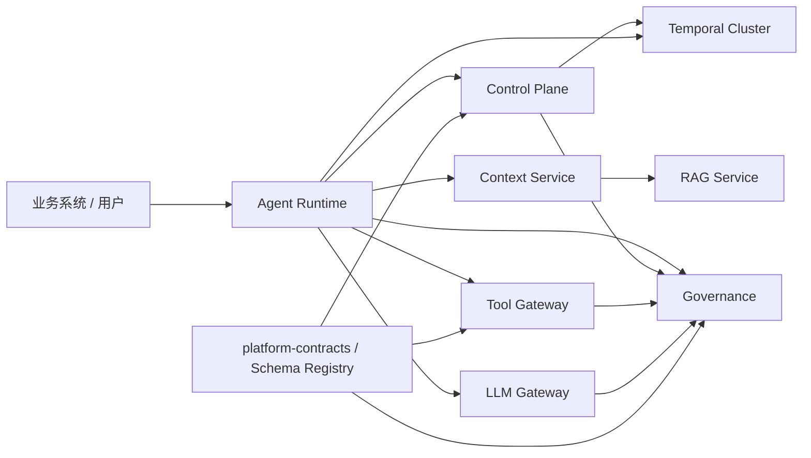

# Agent Platform

面向企业知识问答、受控业务自动化和合规审计的多服务 Agent 平台。仓库采用 monorepo
组织共享契约、部署文件和联调脚本；运行时仍保持明确的服务边界，因此可以按负载、数据域和
合规等级独立部署与扩缩容。

平台不把“Agent”视为可以任意调用模型和工具的聊天程序，而是将一次运行约束为：由已发布
的不可变快照定义能力，经过身份验证、上下文预算、检索、模型决策、工具审批和审计事件的
可追踪执行过程。

## 架构总览



## 七个逻辑服务

| 服务 | 核心职责 | 明确不负责 | 主要代码位置 |
| --- | --- | --- | --- |
| Control Plane | 定义 Agent、版本、发布、发布快照、质量门禁与发布编排 | 在线执行 Agent Loop | `agent-control-plane/` |
| Agent Runtime | 状态机、LangGraph、Harness、规划、预算、审批恢复与运行编排 | 直接管理业务数据或模型厂商协议 | `rag-agent-service/apps/agent_runtime/` |
| Context Service | 会话记忆、证据组织、角色/时间/相关性/可信度排序、Token 预算 | 直接执行业务副作用 | `rag-agent-service/apps/agent_context_service/` |
| RAG Service | 文档摄取、索引、ACL 检索、混合召回、重排和证据返回 | 决定 Agent 的下一步动作 | `rag-agent-service/apps/rag_query_api/`、`apps/ingestion_*` |
| LLM Gateway | 多供应商调用、模型路由、限流、熔断、成本与模型策略 | 管理业务流程和工具权限 | `llm-gateway/` |
| Tool Gateway | 工具目录、参数校验、权限、审批、幂等与安全执行 | 让模型绕过治理直接访问业务系统 | `tool-gateway/` |
| Governance | 审计、评测、合规工作流、问题发现与不可变证据 | 同步阻塞主业务流程 | `agent-governance/` |

共享目录：

- `platform-contracts/`：跨服务 JSON Schema、执行上下文和错误协议。
- `platform-infra/`：OIDC/mTLS、PostgreSQL、OPA、Schema Registry 等共享基础能力。
- `compose.platform.yaml`：本地联调拓扑。
- `compose.production.yaml`：生产依赖与安全配置模板。

## 一次 Agent 运行的生命周期

1. 调用方携带 OIDC Token 进入 Runtime。身份中间件验证 JWT，并从权限声明重建内部身份
   Header；业务代码不会信任调用方自行伪造的权限 Header。
2. Runtime 向 Control Plane 解析 Agent 发布版本，取得不可变发布快照。快照包含模型、知识源、
   工具版本、预算、审批和输出约束。
3. Snapshot Compiler 将快照编译成 Runtime 可执行计划；配置不完整、能力越权或工具版本不存在时
   在运行前失败。
4. Context Service 读取会话消息，并按角色、时间、相关性与来源可信度进行排序。需要知识时调用
   RAG Service；若检索被声明为可选且不可用，则显式标记为 `memory-only` 降级。
5. Runtime 的 LangGraph 先执行规划，再在发布计划的允许范围内循环决策、检索、调用工具和观察。
   Harness 是统一执行门面，LangGraph 仍是状态机与中断恢复实现。
6. LLM Gateway 负责实际模型调用与路由。Tool Gateway 负责工具输入/输出 Schema、租户、权限、
   风险审批、一次性消费和幂等键。
7. `controlled_scan` 只可扫描预注册范围内的日志、源码或文本文件；结果会脱敏、截断，并在进入
   Prompt 前应用内容上限。
8. Runtime、Control Plane、Tool Gateway 和 LLM Gateway 通过 Outbox/事件向 Governance 写入审计。
   Governance 的评测与合规处理异步进行，不会把主运行链路变成同步依赖。

## 发布与执行的一致性模型

Control Plane 管理草稿，Runtime 只消费发布快照。发布时依次完成：

1. Agent Spec 静态校验；
2. Tool Catalog Schema 校验与工具版本存在性校验；
3. Governance 质量门禁；
4. 生成不可变 Snapshot 和 Outbox 事件；
5. 通过 CAS/Saga 推广到目标环境。

这样，某次运行永远可以用 `snapshot_id` 还原“当时允许哪些模型、知识源和工具”，而不会受之后
草稿修改影响。

## 安全与治理边界

- 身份：生产环境使用 OIDC/JWT、工作负载身份与 mTLS；`X-Permissions` 是经过验证 Token 重建的
  兼容接口，而不是信任来源。
- 契约：Tool Catalog 与 Governance Event 进入统一 Schema Registry，服务启动和事件入口均为
  fail-closed 校验。
- 工具：工具只能来自版本化 Catalog；高风险工具要求审批，审批在副作用前一次性消费。
- 数据：RAG 按租户、用户和文档 ACL 检索；Context 的 Token 分配可解释且有上限。
- Prompt：扫描/工具返回值在进入模型前脱敏、结构化裁剪和长度限制，降低机密泄露与 Prompt 注入风险。
- 审计：关键状态变更使用 Outbox 可靠投递；生产可接 Kafka、对象存储/WORM 与 Hash Chain 外部锚定。

## Temporal 与跨区域执行

Temporal Cluster 是工作流编排基础设施，不是七服务之一。Control Plane 使用它编排发布工作流，
Runtime 使用它持久化长运行 Agent 执行。

Runtime 以 `agent-run/<tenant>/<run>` 生成全局幂等 Workflow ID，并使用区域化 Worker Queue。
提交失败时按首选区域、主区域和候选区域顺序尝试；同一个 Workflow ID 避免跨区域故障转移产生
重复运行。真实生产故障转移仍应通过多区域 Temporal 集群、DNS/流量策略和恢复演练验证。

## 本地开发

要求：Python 3.12、Java 17+、Docker Compose（完整联调）以及可选的 Node.js（Gateway 前端）。

```powershell
docker compose -f compose.platform.yaml up --build -d
python scripts/platform_e2e.py
```

Python 服务测试：

```powershell
$env:PYTHONPATH = "$PWD/platform-infra"
py -3.12 -m pytest -q
```

LLM Gateway 测试：

```powershell
cd llm-gateway
mvn test
```

各 Python 服务统一使用 Ruff：Python 3.12、100 字符行宽、`E/F/I/UP/B/SIM/RUF` 规则和双引号格式。

## 生产部署建议

最小生产拓扑应至少包括：多副本 Runtime、LLM Gateway 和 Tool Gateway；PostgreSQL；Redis；Kafka；
OpenSearch/向量数据库；对象存储；OIDC Provider；OPA；以及独立 Temporal Cluster。将 Control Plane、
Governance Consumer、RAG Ingestion Worker 与 Runtime Worker 分开部署，避免在线流量与异步任务互相抢占。

部署前必须替换示例密钥、启用 OIDC/mTLS、使用 PostgreSQL、配置对象存储审计保留策略，并执行：

1. 发布快照与 Tool Catalog 一致性校验；
2. RAG memory-only 降级验证；
3. Tool 审批重放与重复提交验证；
4. Temporal 区域故障转移与 Worker 恢复演练；
5. Trace、Metrics、SLO 和告警恢复演练。

## 贡献约定

- 业务 Agent 的差异放在 Control Plane Catalog、发布快照和业务工具/知识源配置中，不复制平台执行流程。
- 新增跨服务 Payload 前，先在 `platform-contracts/schemas/` 增加版本化 Schema，再接入 Schema Registry。
- 新增工具前，先加入 Tool Catalog，并在发布快照中显式绑定工具版本与权限。
- 不提交 `.env`、私钥、数据库、日志、模型响应样本或本地构建产物。
