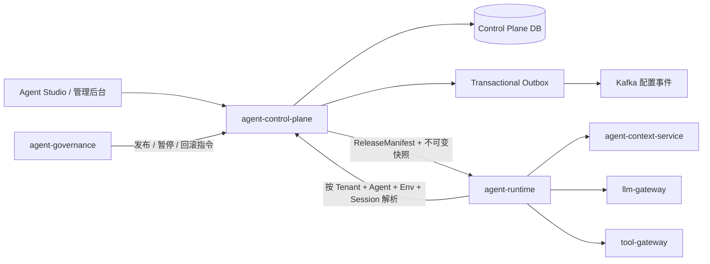

# agent-control-plane

> 用于发布决策的 Governance Gate 必须引用不可变 `EvaluationSnapshot`。其中冻结的模型路由版本和
> model revision 会在 Judge 调用前由 LLM Gateway 校验，避免评测模型发生无记录漂移。

Agent 管理面与配置面。它负责定义、校验、版本化和发布 Agent，但**不执行 Agent
推理**。线上 Runtime 只读取已经发布的不可变快照，不直接读取会持续变化的草稿表。

模型路由发布编排也由 Control Plane 持有：读取 Governance 质量门禁，通过
Gateway 执行灰度策略，监控 Gateway 性能后提升或回滚。Gateway 原有
`/admin/releases` 仅作为兼容代理。

## 为什么需要这个服务

如果 Runtime 直接读取可编辑配置，同一个 Agent ID 在两次请求之间可能对应不同 Prompt、模型、
工具或知识索引，评测、审批和审计也就无法证明生产实际运行了什么。Control Plane 把“人可以编辑的
声明”转换为“机器只能按版本执行的工件”，并成为 Agent、Workflow、Skill、Tool、模型路由和租户策略
的管理面事实源。

它解决的是定义与发布一致性，而不是在线推理性能。一次正式运行必须能够从 `release_id`、
`version_id`、`snapshot_id` 和内容哈希反向还原当时允许的 Graph、Prompt、能力、模型、知识、预算和
审批规则。

## 在单 Agent 与 Multi-Agent 中的作用

单 Agent 场景中，本服务固定一个 Agent 的完整执行边界。Multi-Agent 场景中，它进一步固定主管可委派的
子 Agent、能力绑定、最大拓扑约束和各责任主体的独立发布版本。父 Agent 只能请求快照已声明的能力或专家，
不能临时创造未审核 Agent，也不能把自己的权限隐式授予子 Agent。

```text
Agent/Workflow/Skill/Tool Draft
  → Schema 与策略校验
  → 不可变 Version
  → Agent Lab / Governance 质量证据
  → Release CAS/Saga
  → Snapshot Compiler
  → Runtime Artifact + Runtime Projection
```

其中 Snapshot 面向 Runtime；Tool Runtime Projection 面向 Tool Gateway；模型路由和配额投影面向 LLM
Gateway。三类投影均只包含执行所需的最小契约，不泄漏草稿、审核意见或管理凭据。

## 核心数据与一致性

| 对象 | 含义 | 关键不变量 |
| --- | --- | --- |
| Draft/Spec | 可编辑声明 | 用 revision CAS 防止覆盖并发修改 |
| Version | 已冻结语义版本 | 内容和 SHA-256 不可变 |
| Release | 某环境当前部署选择 | 灰度、暂停、提升、回滚均受状态机约束 |
| Runtime Snapshot | Runtime 可执行工件 | 与 Version、能力目录、工具和模型修订一致 |
| Runtime Projection | Gateway 最小执行目录 | 只投影已审核、已发布资产 |
| Outbox Event | 已提交管理事实 | 与业务状态同事务写入，异步交给 CDC/Kafka |

生产发布不是单次数据库更新：质量门禁、目标 Runtime 集群能力证明、版本 CAS、发布 Saga、流量提升与回滚
共同构成生命周期。任何证据缺失、版本漂移或目标集群能力不匹配都会失败关闭。

## Progressive Release Projection

同一个不可变 Snapshot 可以经历 Shadow、Canary 与 Production；阶段变化不会重新编译 Agent。
Control Plane 为每个 Release 持久化 `ReleaseProjection`，其中固定 `release_stage`、候选/基线
关系、流量与副作用策略版本、Shadow 采样率/资源预算及递增 Revision。Runtime 创建 Run 时将其
一起钉扎，恢复和重试不重新按当前流量推导。

```text
Snapshot = Agent 定义、Graph、Skill、Model、Tool、知识版本
Projection = Shadow / Canary / Production 的流量与副作用执行策略

`start-canary` 还可冻结 `eligible_roles` 和 `excluded_roles`。这些值只匹配 Runtime 从用户已验证
OIDC 身份中重建后、经服务身份传来的 `X-Subject-Roles`，只会让候选范围变小；不匹配时稳定 Release
继续服务。Control Plane 不接受调用方自报的业务风险、Prompt 标签或任意 metadata 作为路由授权。
```

`POST /v1/releases/{id}/start-shadow` 只发布内部镜像资格，正常 Runtime Resolve 永远不会将
该 Release 返回给业务用户；`resolve-shadow` 仅供受信任镜像 Worker 使用，并返回确定性采样结论。
`start-canary` 必须消费 Governance 已保存的 `PROMOTE` GateDecision。Control Plane 不接受浏览器
传入任意 stage 来改变执行模式。

## 已实现能力

- 多租户 Agent 草稿与乐观并发控制
- Graph、Prompt、Tool、知识库、模型路由、运行上限的统一定义
- Graph 可达性、Prompt 变量、高危 Tool 审批、模型/数据区域策略校验
- 语义版本发布与 SHA-256 内容指纹
- 完整、不可变、自描述的 Runtime 快照
- 模型路由质量门禁、灰度、监控、自动提升与回滚
- 首次全量发布、确定性灰度、租户白名单和会话粘滞
- 灰度推进、暂停、回滚，以及回滚后会话安全重绑定
- 租户级模型、数据区域和最大灰度比例策略
- 与业务写入同事务的 Outbox 事件
- 可选强制关联 Agent Lab 的 laboratory 回放证据，防止无关 Gate 或草稿直接进入正式发布
- Runtime Executor Catalog：发布前确认目标环境存在匹配执行器，并由 Runtime 实例实时证明能力
- 管理端与 Runtime 端分离的鉴权入口
- OpenAPI、Docker、Compose、调用样例和自动化测试
- 独立 Skill Draft/Version 与 `VALIDATING -> CANDIDATE -> CANARY -> ACTIVE` 准入状态机
- 独立 Workflow Draft/Version/Release，支持零 Agent 执行工件
- 渐进披露 Skill Catalog，未选中前不返回 Prompt、Tool 和 Knowledge 绑定
- 随 Agent/Workflow 工件冻结 Capability Provider 目录和逐能力回退顺序
- 发布前校验 Active Skill、Tool Catalog 和 Workflow Provider 的精确版本/摘要
- 发布 Agent 时以 Tool Catalog 为权限、风险、审批和幂等事实源冻结工具绑定；发布 Skill
  时校验 Governance Profile 不得降低其内部 Tool 的真实风险
- 租户策略可声明 `llm_quotas`，Control Plane 保存权威配置并将租户/用户 Token 与 USD 日配额
  投影到 LLM Gateway；模型供应商密钥仍只由 Gateway 持有，Console 不接触密钥。
- Tool Asset 生命周期：`Draft -> Candidate Version -> Approved -> Runtime Release -> Deprecated/Retired`；
  Draft 用 revision CAS 编辑，版本内容和 SHA-256 不可变，审核与 Release 都写事务性 Outbox。
- Tool Gateway 通过受工作负载身份保护的 `/internal/v1/tool-catalog/runtime-projection` 拉取已发布
  Release 的最小执行契约并持久化缓存；未审核、被拒绝、弃用中的 Draft 与审核意见不会离开 Control Plane。

## 边界



本服务不会运行 LangGraph/Workflow/Skill、保存聊天记录、检索知识、调用模型
或执行业务工具。

## 最重要的发布约束

1. `AgentDefinition` 是可编辑草稿，更新必须携带 `expected_revision`。
2. 发布前必须通过配置和租户策略校验。
3. `AgentVersion` 一经生成不可修改；相同 Agent 不能重复使用语义版本号。
4. `ReleaseManifest` 只引用已发布的 `version_id`。
5. 首个环境版本强制 100% 发布，避免不存在回退基线。
6. 新会话按稳定哈希进入灰度；已有会话固定到原 Release。
7. 回滚后，绑定到问题 Release 的会话在下次解析时切回上一稳定版本。
8. 配置变更与 Outbox 事件在同一数据库事务提交。
9. 启用 Agent Lab 门禁后，正式 Release 还必须引用完成的 laboratory 实验，且实验的租户、Agent、
   版本和 Judge Run 必须与发布请求完全一致。
10. 生产发布必须通过 Runtime Executor Catalog：目标环境声明 `runtime_executor` Profile，至少一个
    Runtime 实例的 `/api/v1/agent/capabilities` 返回同一 Catalog 版本和该 Profile。
11. `AgentVersion` 生成时会在同一事务内把 `PublishedSnapshot` 编译为 `runtime-snapshot/v1`
    Artifact；生产 Runtime 只加载并校验该 Artifact 的快照哈希，缺失或漂移即拒绝执行。
12. 生产环境下 Agent 的 `ToolBinding(name, version)` 必须能解析到同租户、同语义版本且状态为
    `PUBLISHED` 的 Tool Runtime Release；缺失、未审核或已退役版本会在 AgentVersion 冻结前失败。

## Tool Asset 生命周期

Tool Catalog 的管理面在本服务，执行面在 Tool Gateway。推荐按以下 API 顺序管理一个工具：

1. `POST /v1/tools` 创建 Draft，`PUT /v1/tools/{tool_id}/draft` 携带 `expected_revision` 做 CAS 编辑；
2. `POST /v1/tools/{tool_id}/versions` 冻结 Candidate Version，正文与 `content_sha256` 不可再修改；
3. `POST .../review` 记录 approve/reject、审查人和评论；未通过审核的版本不能发布；
4. `POST .../release` 生成该工具唯一 Active Runtime Release，并使 Gateway 下次投影刷新后可执行；
5. `POST .../status` 可先 `deprecated` 再 `retired`；`retired` 会撤销 Active Release，Gateway 不再获得该定义。

本地 Compose 中的 `config/tool-catalog.json` 仅作为 `demo` 租户的一次性迁移种子；服务启动时把它
导入为完整的 Draft/Version/Review/Release 记录，随后运行时不再把该文件当作权威目录。生产不配置
`CONTROL_PLANE_BOOTSTRAP_TENANT_ID`，必须由管理员通过上述 API 创建并发布工具资产。

当前 Tool Gateway Registry 以 `tool_name + semantic_version` 全局键控；因此不同租户不能同时发布
同名同版本但正文不同的工具。Control Plane 在 Release 前会拒绝这种冲突。若确有隔离需求，应使用
租户限定的工具名，或发布一条平台统一工具并通过 `enabled_tenants` 控制可见范围。

发布后的快照同时包含可观察版本号和完整配置：

```json
{
  "agent_version": "customer-service:1.8.2",
  "graph_version": "customer-service-graph:17",
  "prompt_version": "customer-service-system:17",
  "knowledge_version": "kb:39b45ef83d97",
  "tool_set_version": "tools:928d3e40c7f1",
  "model_policy_version": "balanced-routing:17",
  "spec": {
    "graph": {},
    "prompt": {},
    "tools": [],
    "knowledge": [],
    "model_policy": {},
    "runtime_limits": {}
  }
}
```

## 快速启动

要求 Python 3.12。

```powershell
cd C:\Users\Administrator\Documents\AI工作\agent-control-plane
python -m venv .venv
.\.venv\Scripts\Activate.ps1
python -m pip install -e ".[dev]"
Copy-Item .env.example .env
uvicorn app.main:app --reload --port 8080
```

打开 `http://localhost:8080/docs` 查看和调试 OpenAPI，或直接运行
[http/control-plane.http](http/control-plane.http) 中的完整发布流程。

也可以使用容器：

```powershell
docker compose up --build
```

## 身份与隔离

管理 API 默认要求：

```text
X-Tenant-Id: tenant-a
X-User-Id: architect@example.com
X-Roles: agent-admin
X-Trace-Id: trace-optional
```

本地默认不强制角色；生产设置 `CONTROL_PLANE_ENFORCE_ADMIN_ROLE=true`。Runtime API
可通过 `CONTROL_PLANE_RUNTIME_API_KEY` 启用独立的 `X-Runtime-Key`。

若将 Agent Lab 作为发布前回放门禁，生产还应设置：

```dotenv
CONTROL_PLANE_AGENT_LAB_REQUIRED=true
CONTROL_PLANE_AGENT_LAB_BASE_URL=https://agent-lab:8092
CONTROL_PLANE_AGENT_LAB_SERVICE_API_KEY=<service-secret>
```

Control Plane 会用服务密钥读取 Agent Lab 的内部 release evidence，并拒绝实验环境不是
`laboratory`、未完成、未通过 Gate，或 `quality_gate_run_id` 不一致的请求。该检查补充
Governance Gate，不取代 Governance 的评测和审计职责。

生产还必须挂载版本化 `runtime-executors.json`，并设置：

```dotenv
CONTROL_PLANE_RUNTIME_EXECUTOR_CATALOG_REQUIRED=true
CONTROL_PLANE_RUNTIME_EXECUTOR_CATALOG_PATH=/service/runtime-catalog/runtime-executors.json
CONTROL_PLANE_RUNTIME_EXECUTOR_CATALOG_SERVICE_API_KEY=<runtime-service-secret>
```

目录按环境列出可接收流量的 Runtime Cluster、base URL 和执行器 Profile。Control Plane 创建
Release 时不会只相信静态目录：它会调用候选实例 capabilities 接口，要求实例返回同一 Catalog
Version 和 `runtime_executor`。目录版本、摘要和目标 Cluster ID 会冻结到 Release 与 Outbox 事件。

数据库查询、版本、发布、策略和 Outbox 均以 `tenant_id` 隔离。

## API

| 方法 | 路径 | 用途 |
|---|---|---|
| `POST` | `/v1/agents` | 创建 Agent 草稿 |
| `PUT` | `/v1/agents/{id}/draft` | 按 revision 更新草稿 |
| `POST` | `/v1/agents/{id}/validate` | 执行发布前校验 |
| `POST` | `/v1/agents/{id}/versions` | 生成不可变版本 |
| `POST` | `/v1/agents/{id}/releases` | 首次发布或启动灰度 |
| `POST` | `/v1/releases/{id}/promote` | 增加灰度比例或全量 |
| `POST` | `/v1/releases/{id}/pause` | 暂停给新会话分配灰度 |
| `POST` | `/v1/releases/{id}/rollback` | 回滚上一稳定 Release |
| `GET` | `/v1/runtime/agents/{id}/resolve` | 为一次会话解析运行版本 |
| `GET` | `/v1/runtime/releases/{id}/snapshot` | 按 Release 获取快照 |
| `GET/PUT` | `/v1/tenant-policy` | 查询或更新租户策略 |
| `GET` | `/v1/outbox` | 查看待集成的配置事件 |

创建 Release 时，开启 Agent Lab 门禁的租户必须在请求中提供 `agent_lab_experiment_id` 与
`quality_gate_run_id`；两者均来自同一个已冻结的实验，而不是用户可任意填写的字符串。

Runtime Resolve 示例：

```http
GET /v1/runtime/agents/customer-service/resolve
    ?environment=production
    &session_id=session-001
X-Tenant-Id: tenant-a
X-Runtime-Key: ...
```

返回值包含选中的 `release_id`、`version_id`、分配原因和完整快照。Runtime 可以用
`release_id + content_hash` 作为本地缓存键。

## Outbox 与 Kafka

每个事件都包含：

```text
event_id
event_type
trace_id
tenant_id
aggregate_type
aggregate_id
occurred_at
schema_version
payload
```

本实现保存 Transactional Outbox，不在业务事务中同步调用 Kafka。生产环境建议使用
CDC/Kafka Connect 发布 `outbox_events`，消费端以 `event_id` 幂等。当前事件包括
`AgentCreated`、`AgentDraftUpdated`、`AgentVersionPublished`、
`ReleaseCanaryStarted`、`ReleasePromoted`、`ReleasePaused`、
`ReleaseRolledBack` 和 `TenantPolicyUpdated`。

## 数据存储

当前仓库使用 SQLite，目的是让领域规则、API 契约和端到端流程可在单机与 CI
零依赖运行。数据库边界保持独立，没有跨服务查表。进入多实例生产部署时应将
`SqliteRepository` 替换为 PostgreSQL 实现，并把高频 Session Binding 缓存在 Redis；
上层领域服务与 API 契约无需改变。

## 验证

```powershell
python -m ruff check .
python -m ruff format --check .
python -m pytest
```

测试覆盖配置校验、草稿并发冲突、快照不可变、多租户隔离、灰度会话粘滞、回滚重绑定、
租户模型策略和 Outbox 事件。
