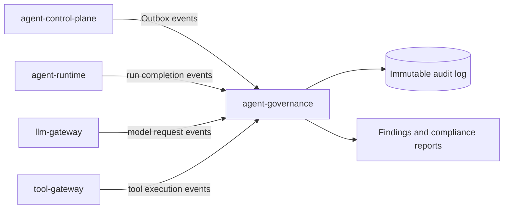

# agent-governance

独立的 Agent 治理服务。它接收各服务已经发生的事件，持久化不可变审计记录，按租户策略生成评测发现（findings），并提供处置与合规汇总查询。

它**不是** `agent-control-plane`：控制面决定 Agent 的定义、版本和发布；治理服务拥有评测资产、Judge、质量门禁、线上样本和合规工作流。Control Plane 可以同步读取质量门禁结论，但治理服务不直接修改 Gateway 路由，也不执行 Agent 或业务工具。

在线请求中的计划准入由 Runtime Guard 完成，具体 Tool 动作的最终授权由 Tool Gateway
完成。Governance 接收 `tool.authorization.decided`、执行结果和 Trace 做异步审计，并负责
Golden、回归、Bad Case 与发布质量门禁；它不成为每次副作用调用的同步授权代理。

它也**不是** `agent-lab`：Agent Lab 负责冻结发布快照、编排离线回放和保存基线差异；本服务
继续是通用评测引擎与规则所有者。即使直接调用 Governance 的 Judge/Gate API，也不会自动获得
发布权限；启用 Agent Lab 门禁时，Control Plane 还会校验同一实验生成的内部 release evidence。

需要模型语义判断时，Governance 只通过 `GOVERNANCE_LLM_GATEWAY_BASE_URL`
调用 `llm-gateway`，不持有模型厂商密钥。核心接口位于
`/v1/governance/evaluations` 与 `/v1/governance/compliance`；Gateway 原有
`/admin/eval`、`/v1/feedback` 和 `/admin/compliance` 接口保留为兼容代理。



## 为什么需要独立治理服务

把评测、审计和合规直接塞进 Gateway 或 Runtime，会让线上主链路同时承担执行与裁决，并形成“负责运行的代码
给自己打分”的冲突。Governance 只消费已经提交的事实，管理评测资产、规则、人工复核和质量决策；Control
Plane 再决定是否执行发布动作。

治理本身也必须可治理。每次 Judge/Regression 运行都会冻结模型 revision、路由版本、Prompt、Rubric、Golden
Case、温度、输出 Schema 和检索策略。上述任一项变化都产生新的 EvaluationSnapshot，并要求重新校准，不能
沿用旧准入结论。

## 治理闭环

```text
Expert-labelled Golden / Red Team / Production Bad Case
  → Frozen EvaluationSnapshot
  → Regression / Judge Run
  → Calibration (Accuracy / MAE / Confusion Matrix / Kappa)
  → Grouped Hard Gate
  → PASS / FAIL GateDecision
  → Control Plane Release
  → Shadow / Canary Production Trace
  → Drift / SLO / Safety Gate
  → HOLD / PROMOTE / PAUSE / ROLLBACK
  → Human Review
  → Golden Candidate
```

真正的 RAG 指标基于固定 Document/Chunk ID 计算 Recall@K、Precision@K、MRR 和 nDCG；回答阶段再计算证据
覆盖、引用正确性和 Faithfulness。检索评测同时记录 ACL Leakage、过期证据和冲突证据比例；ACL Leakage
只要非零即触发 Hard Gate，不能被总体平均分掩盖。高风险用例可以要求零失败和关键证据 100% 召回。

候选检索版本的线上比较使用 `POST /v1/governance/evaluations/retrieval-shadow` 记录：请求正文只保留查询摘要，
而不是原始用户问题；结果记录基线/候选 Release、Evidence 集合重叠、ACL 泄漏率、延迟、成本和是否具备 Canary
资格。它不能自行切流，Control Plane 仍需消费通过的 GateDecision 才能执行 Shadow → Canary 或回滚。

## Multi-Agent 中的作用

Governance 不调度专家，但能把每个父子 Run、Snapshot、模型、工具、Evidence 和裁决结果关联到同一 Root Task。
它可分别评估主管的任务拆解、专家选择、工具权限、证据质量、冲突收敛和最终答案。不同专家意见不一致时，
Runtime 可以形成 Judge/Human 中断；Governance 提供冻结 Judge、Rubric、校准证明和人工标注回流，而不是让
主管模型无证据地决定谁正确。

线上样本按高风险、低分、模型分歧、新模型和新知识域分层抽样。人工复核先形成带 `labelerId`、审核状态和
关键性的 Bad Case/Golden Candidate，只有审核通过后才进入 Golden Dataset。

## 当前能力

### 评测自身的可复现性

每次 Regression 或 Judge Run 均先生成不可变 `EvaluationSnapshot`，并将其
ID 与 SHA-256 写入运行记录。Snapshot 冻结 Prompt、Golden Case、Rubric、模型
及其 provider revision、Gateway route version、temperature/top_p/max_tokens 和
`governance-judge-output/v1` JSON Schema。评测资产后续更新不会改变已完成
Run；若模型供应商未遵从结构化输出，Governance 会本地 fail-closed 拒绝结果。

- 幂等接收事件：同一 `event_id` 只会记录和评测一次。
- 记录不可变审计事件，按租户隔离并可使用游标查询。
- 规则评测：未获批准的高风险工具调用、违规模型、违规数据区域、缺少知识证据、成本或时延超限。
- 管理每个租户的治理策略；处置发现保留处理人、处理时间和说明。
- 策略变更同样作为 `governance.policy.updated` 事件写入审计日志。
- 输出按事件来源、风险等级和未处理发现汇总的合规报告。
- 以持久化作业执行 WORM 导出：先验证租户哈希链，再流式生成 Merkle 承诺和签名包，写入启用
  Object Lock 的对象桶；作业支持租约、多 Worker、指数重试、DLQ、显式重排和证明查询。

## 事件契约

生产者将 Outbox 事件转换为如下 HTTP 载荷后，投递到 `POST /v1/governance/events`。服务只消费事件，不向生产者回调或发出控制指令。

```json
{
  "event_id": "evt_01J...",
  "source_service": "tool-gateway",
  "event_type": "tool.execution.completed",
  "trace_id": "trace_01J...",
  "tenant_id": "tenant-a",
  "occurred_at": "2026-07-25T00:00:00Z",
  "payload": {
    "run_id": "run-123",
    "tool_name": "payments.refund",
    "risk": "write_high_risk",
    "approval_granted": false
  }
}
```

支持的首批评测事件是 `tool.execution.completed`、`llm.request.completed` 与 `agent.run.completed`。Runtime 还会写入 `agent.run.state_changed`：它带有 Run、Session、Trace、快照和前后状态，但不携带 Prompt 或用户正文，用于将长运行的状态迁移与最终评测结果关联起来。未知事件仍会完整审计，只是不触发内置规则。

## 快速启动

需要 Python 3.12：

```powershell
cd C:\Users\Administrator\Documents\AI工作\agent-governance
python -m venv .venv
.\.venv\Scripts\Activate.ps1
python -m pip install -e ".[dev]"
Copy-Item .env.example .env
uvicorn app.main:app --reload --port 8081
```

打开 `http://localhost:8081/docs` 查看 OpenAPI。审计查询与策略管理默认使用 `X-Tenant-Id`、`X-User-Id` 和可选的 `X-Roles: governance-auditor`。设置 `GOVERNANCE_ENFORCE_AUDITOR_ROLE=true` 后会强制该角色；设置 `GOVERNANCE_EVENT_INGESTION_KEY` 后，事件生产者必须携带 `X-Governance-Event-Key`。

也可通过 Docker Compose 启动：`docker compose up --build`。

## API

| 方法 | 路径 | 用途 |
| --- | --- | --- |
| `POST` | `/v1/governance/events` | 异步接收并评测事件 |
| `GET` | `/v1/governance/audit-events` | 查询不可变审计记录 |
| `GET` | `/v1/governance/findings` | 查询风险发现 |
| `POST` | `/v1/governance/findings/{id}/resolve` | 记录发现处置 |
| `GET/PUT` | `/v1/governance/tenant-policy` | 查询或更新治理策略 |
| `GET` | `/v1/governance/reports/compliance` | 查询租户合规汇总 |
| `POST/GET` | `/v1/governance/audit-exports` | 创建或列出租户 WORM 导出作业 |
| `GET` | `/v1/governance/audit-exports/{job_id}` | 查询对象键、摘要、Merkle Root 和签名身份 |
| `POST` | `/v1/governance/audit-exports/{job_id}/requeue` | 对 DLQ 作业执行显式审计重排 |
| `PUT` | `/v1/governance/evaluations/golden-dataset` | 维护版本化 Golden Case 与专家标签 |
| `POST` | `/v1/governance/evaluations/regression-runs` | 运行冻结回归评测 |
| `POST` | `/v1/governance/evaluations/judge-runs` | 创建固定版本 Judge Run |
| `POST` | `/v1/governance/evaluations/judge-runs/{run_id}/calibration` | 用专家集校准 Judge |
| `POST` | `/v1/governance/evaluations/judge-runs/{run_id}/quality-gate` | 计算发布前分组 Hard Gate |
| `POST` | `/v1/governance/evaluations/online/gate` | 计算线上连续治理决策 |
| `GET` | `/internal/v1/governance/gate-decisions/{decision_id}` | 供 Control Plane 读取不可变决策 |

生产必须使用 `GOVERNANCE_WORM_SIGNING_MODE=kms`、独立 KMS 签名密钥和开启 Compliance Object
Lock 的专用桶。本地 Compose 的 MinIO + HMAC 只用于验证协议，不能作为监管级不可抵赖证明。

## 验证

```powershell
python -m ruff check .
python -m ruff format --check .
python -m pytest
```
## 双阶段连续治理

Governance 将发布质量拆成两个不可互相替代的阶段：

1. **Pre-production**：冻结 Snapshot、Golden/Red-Team Dataset、Judge、Rubric、模型修订和
   检索策略后执行离线评测，并输出 `PASS` 或 `FAIL` 的 GateDecision；Control Plane 以该证据创建 Release。
2. **Online**：按 `releaseId + snapshotId` 聚合 Shadow/Canary Trace，检查最小样本量、错误率、
   P95 延迟、成本和硬安全信号，输出 `HOLD`、`PROMOTE`、`PAUSE` 或 `ROLLBACK`。

Governance 只保存证据、计算指标和做决策；它不直接改变流量。Control Plane 通过
`POST /v1/releases/{release_id}/governance-action` 拉取 GateDecision，再校验租户、Release 与
冻结 Agent Version 一致后才调用自己的 Promote/Pause/Rollback 状态机。

`forbiddenTool`、`piiLeak` 与 `crossTenantAccess` 是线上 Hard Gate：任一非零即 `ROLLBACK`；
样本不足只会 `HOLD`，不会因偶然的 100% 成功率提升流量。人工确认的线上失败保存为 `BadCase`，
随后可作为 Golden Candidate 审核并进入下一轮回归集。

Online Gate 还可按策略检查最小观察时长、Decision Agreement、Authorization Agreement、False Side
Effect Rate、工具参数正确率，以及候选 Snapshot 相对 Baseline 的错误率、延迟和成本回归。未标注的
Shadow 判断不会被当作“正确”，必须等待人工/规则/Judge 形成可用标签后才可作为提升证据。
