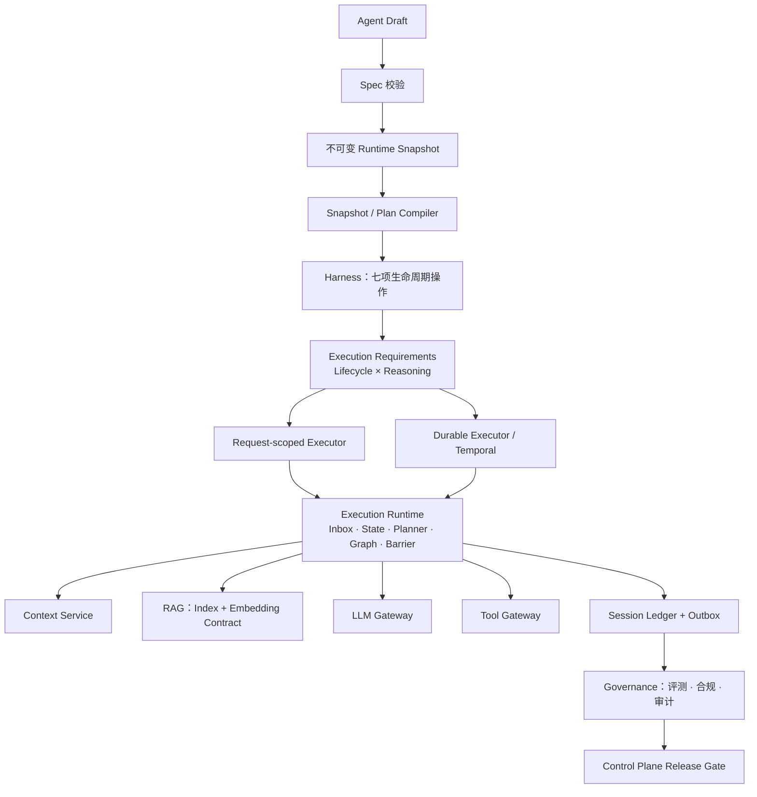

# 企业级 Agent Platform 整改路线图

> 状态：进行中。本文把架构整改项映射到实际代码，而不是把讨论中的每一项都当作缺失功能。
> 最后更新：2026-08-18。

## 判定口径

- **已覆盖**：生产路径已有明确边界、失败语义和至少一项自动化验证。
- **部分覆盖**：有数据结构或局部实现，但没有贯通到执行、发布或恢复路径。
- **待实现**：当前不存在，或实现会导致安全/一致性缺口。

## 初始核查矩阵

| 编号 | 整改目标 | 核查结果 | 依据与处置阶段 |
| --- | --- | --- | --- |
| ARCH-001 | Harness 仅是生命周期门面 | 已覆盖 | `AgentHarness` 已限定为发布解析、快照、上下文、执行器、运行、恢复、取消七件事；不把 Loop 放回 Harness。 |
| EXEC-001 / DUR-001 | 生命周期与推理方式解耦 | 已覆盖 | `execution.lifecycle × execution.reasoning` 编译为唯一已部署 Profile；共享 Snapshot Artifact、Runtime 与 Temporal 路由使用同一契约。 |
| EXEC-002 | 显式 Run 状态机 | 已覆盖 | `run_state.py`、持久化状态转换和终态保护已存在。 |
| EXEC-003 | 统一运行时 Inbox | 部分覆盖 | 用户、Steering 与 Follow-up 已经由 RunMailbox 以租约、优先级和幂等键进入安全点；审批与 Temporal Signal 仍使用各自的恢复路径，必须在下一次接口兼容性窗口迁移，不能假称已统一。 |
| EXEC-004 | 输入与执行尝试语义统一 | 部分覆盖 | 邮箱项、Run 状态事件、Session Ledger 的 Run/Turn/Step/Epoch/Attempt ID 已可关联；审批和 Signal 尚缺少同一输入投影，暂不将其作为“完全闭环”。 |
| TOOL-001 | 受控工具计划/调度/工具事实 | 已覆盖 | 已有发布工具策略、资源锁、Gateway 幂等与 intent/dispatched/committed/result 会话事实。 |
| TOOL-002 | 副作用屏障 | 已覆盖 | `SideEffectBarrier` 在预算预留和 Gateway 调用前检查取消、快照、幂等与待处理 Steering；需要重规划时不调工具。 |
| CAP-001 | 强类型 RuntimeContext | 已覆盖 | Graph 接收冻结的 `RuntimeContext`，不再依赖泛型服务定位器。 |
| CAP-002 | 能力 Provider 生命周期 | 已覆盖 | 运行时投影使用启动期命名注册句柄，并在容器冻结后拒绝请求期动态扩展；停止时可显式注销。 |
| SESSION-001 | 会话事件账本与派生投影 | 已覆盖 | Session Ledger、序号、回放、压缩/归档与工具事实恢复已落地。 |
| SESSION-002 | Request Epoch | 已覆盖 | Epoch 固定模型路由/修订、Prompt、工具、知识索引嵌入契约、预算及输出 Schema，全部写入会话账本。 |
| EVENT-001 | 事件总线与 Projector | 已覆盖 | 进程内总线支持启动期命名投影、冻结与显式注销；可靠跨服务审计仍由 Outbox/CDC 负责。 |
| PLAN-001 | 计划编译与预算验证 | 已覆盖 | Snapshot Compiler、Workflow 条件编译、预算和权限指纹已存在。 |
| PLAN-002 | Agent Catalog/版本化声明 | 已覆盖 | Control Plane 允许把版本化 `intent_catalog` 与 Agent Spec 一起发布；Compiler 将规则正文冻结到 Runtime Artifact，避免 Runtime 请求期读取可变全局目录。 |
| PLAN-003 | 确定性 + 受治理语义分析 | 已覆盖 | Heuristic 和 Gateway Analyzer 都先校验已发布目录；Gateway 只能在目录声明的意图空间补充语义，目录内容进入执行计划策略指纹。 |
| RAG-001 | 嵌入模型/维度/索引契约 | 已覆盖 | `EmbeddingProvider`/`EmbeddingContract` 固定 Provider、模型修订、维度、归一化与输入上限；DashScope 为 Cloud Baseline，BGE-M3/Qwen3 可经本地兼容 Provider 对比后 Promote。 |
| RAG-002 | 索引版本与查询兼容性 | 已覆盖 | 摄取、Hybrid、OpenSearch 与 Runtime 请求使用同一契约；RAG 拒绝索引或向量空间漂移。 |
| RAG-003 | Hybrid Retrieval | 已覆盖 | BM25、同契约向量、重排和 ACL 均在同一已发布检索边界内执行。 |
| RAG-004 | 检索发布门禁 | 已覆盖 | Governance 的 Recall@K 硬门槛之外，生产 Release 强制知识绑定的索引、嵌入和检索评测证据。 |
| GOV-001 | 评测、审计、合规分离 | 已覆盖 | Governance 内已有独立评测/合规/审计应用边界。 |
| GOV-002 | 治理子平面部署边界 | 已覆盖 | Governance 通过 CDC/Kafka 消费事务 Outbox，独立于 Runtime 同步路径；容器使用 OIDC/mTLS，并以幂等消费者、DLQ 和受控重放维持投影边界。 |
| GOV-003 | 不可变知识绑定 | 已覆盖 | `KnowledgeBinding` 已固定知识、索引版本、嵌入契约与检索评测证据；生产 Release 缺少任一项即拒绝。 |
| OBS-001 | 成本、限流、配额的统一单位 | 已覆盖 | Runtime 下传剩余 USD 预算；Gateway 在 admission/usage/resilience 三层分别记录 RPM、TPM、并发、Token 与 USD，拒绝事件包含稳定 `reasonCode`。 |
| OBS-002 | 指标、Trace、告警 | 已覆盖 | OTEL 与 Prometheus 指标不包含租户、用户或正文标签；部署基线提供按 `reasonCode`、错误预算和 CDC/DLQ 积压配置告警的契约。实际阈值由各环境容量基线配置。 |
| QUAL-001 | Golden、校准、分组 Hard Gate | 已覆盖 | 专家标注、校准、RAG 指标、分组门槛和发布门禁已实现。 |

## 实施顺序

1. **运行内核正确性**：双轴执行需求、SideEffectBarrier、计划事实的版本化表达。
2. **输入与事件闭环**：统一 Inbox 处理器、能力/投影生命周期、完整 Request Epoch。
3. **计划与知识闭环**：意图策略目录、嵌入与索引契约、索引发布门禁。
4. **生产治理闭环**：治理投影、成本/限流指标、SLO/告警与最终架构文档。

## 目标架构

Harness 保持窄边界；状态机、Inbox、Planner、Graph 和副作用屏障属于 Execution Runtime。这样既不把 Harness 膨胀成万能服务，也能保证每个执行器共享同一发布、恢复和取消入口。
