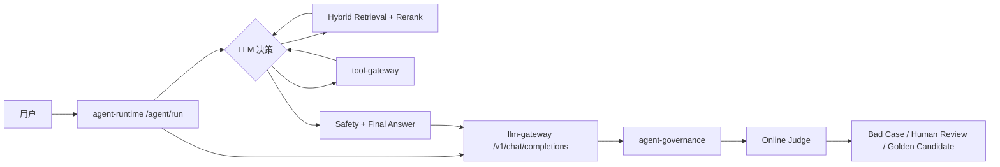

# Agent、RAG 与发布闭环

## 在线链路



Runtime 完成 Agent 执行身份链路，`tenantId/userId/requestId` 通过可信 Execution Context 传给
Context、RAG、Gateway 和 Tool Gateway；请求正文 metadata 不能覆盖身份和权限。Runtime 的模型决策
通过 Gateway `/v1/chat/completions` 调用，因此供应商密钥、路由、fallback、限额和成本继续由
Gateway 统一治理。

## Trace

Gateway 使用 OpenTelemetry Spring Boot Starter 自动追踪 WebFlux、WebClient 和 JDBC；RAG 使用 FastAPI/HTTPX instrumentation，并为 Agent、RAG、Rerank 和 Tool 增加业务 Span。两边都启用后，一个请求可形成：

```text
runtime HTTP server
  -> runtime.plan / graph.run
    -> context/rag HTTP client
    -> gateway /v1/chat/completions -> provider WebClient
    -> tool-gateway invoke -> business API / MCP
  -> governance event ingestion -> judge.evaluate_online_sample
```

本地默认关闭导出。启用示例：

```env
OTEL_SDK_DISABLED=false
OTEL_EXPORTER_OTLP_ENDPOINT=http://localhost:4318
RUNTIME_OTEL_ENABLED=true
RAG_OTEL_ENABLED=true
```

## Release Orchestrator

发布状态机由 `agent-control-plane` 持有。Gateway 的 `/admin/releases` 是兼容
代理；Control Plane 通过 Gateway 的只读性能摘要和路由策略写接口执行灰度、
提升与回滚。

发布状态：

```text
laboratory Release -> Agent Lab snapshot freeze -> Runtime replay
  -> Governance Judge Run -> Quality Gate -> release evidence
  -> Control Plane CAS/Saga -> CANARY_ACTIVE -> MONITORING -> PROMOTED
                                                    -> ROLLED_BACK
```

启动灰度：

```http
POST /admin/releases
Authorization: Basic admin credentials
Content-Type: application/json

{
  "routeName": "deepseek-v4-flash",
  "canaryTarget": "qwen:qwen-plus",
  "judgeRunId": "judge-run-id",
  "canaryPercent": 5
}
```

调用 `POST /admin/releases/{releaseId}/monitor` 后，Orchestrator 从 `ModelPerformanceService` 读取该物理 `provider:model` 自灰度开始后的请求数、错误率、超时率、平均延迟和单请求成本。任一指标越线立即恢复发布前 Route 快照；样本不足保持 `MONITORING`；样本充足且健康时自动提升为 primary，并把旧 primary 加入 fallback。

手动回滚：

```http
POST /admin/releases/{releaseId}/rollback
Content-Type: application/json

{"reason":"manual incident rollback"}
```

Gateway 默认每 30 秒自动扫描一次活动发布，可用 `RELEASE_MONITOR_INTERVAL` 调整。`release-run` 在开启持久化时存入 MySQL；单机内存模式只用于开发测试。
