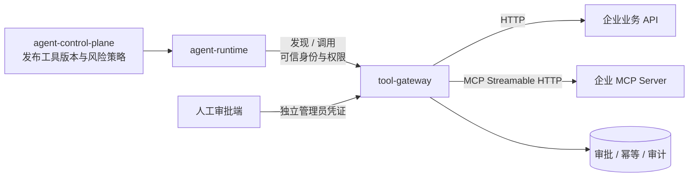

# tool-gateway

企业 Agent 的工具执行面。它位于 `agent-runtime` 与业务 API / MCP Server 之间，统一
完成工具发现、输入输出校验、授权、审批、幂等、限流、超时、重试、熔断和审计。

模型只负责选择已发现的工具并生成参数；模型输出不是可信执行指令，不能绕过本服务
直接访问业务系统。

## 已实现能力

- 按 `tenant + permission` 过滤工具清单，不向模型暴露无权调用的工具
- 工具名与版本绑定，JSON Schema Draft 2020-12 输入和输出校验
- 独立的服务凭证和审批管理员凭证，租户与用户身份由可信 Runtime 注入
- 只读、低风险写、高风险写和强制人工审批四级风险策略
- 写工具强制 `X-Idempotency-Key`；同键同请求重放结果，同键不同请求返回冲突
- 高风险调用先返回 `202 PENDING_APPROVAL`，审批后携带 `approval_id` 才可执行
- 租户/工具级限流、超时、有界指数退避重试和失败熔断
- HTTP 工具适配：Host allowlist、DNS/IP 检查、禁止 userinfo 和重定向，缓解 SSRF
- MCP Streamable HTTP 适配：使用官方 Python SDK 完成初始化和 `tools/call`
- SQLite 持久化审批、幂等结果和审计元数据
- 审计不保存原始参数和幂等键，只保存 SHA-256 摘要
- OpenAPI、Docker、Compose、HTTP 调试样例和自动化测试

## 服务边界



本服务不做模型推理、不决定何时调用工具、不保存 Agent 会话，也不实现具体业务规则。
业务系统仍然必须执行自己的对象级授权、事务约束和业务幂等；Tool Gateway 是集中治理
层，不是业务权限的替代品。

## 调用流程

```text
GET /tools
  -> Tenant 可见性
  -> Permission 过滤
  -> 返回模型可见 JSON Schema

POST /tools/{name}/invoke
  -> 服务鉴权
  -> 解析 Tool name + version
  -> Tenant / Permission 校验
  -> Input Schema 校验
  -> 写操作幂等校验
  -> 高风险审批校验
  -> 限流 / 熔断
  -> HTTP 或 MCP 调用
  -> 超时 / 有界重试
  -> Output Schema 校验
  -> 持久化幂等结果与审计
```

## 快速启动

要求 Python 3.11+。

```powershell
cd C:\Users\Administrator\Documents\AI工作\tool-gateway
python -m venv .venv
.\.venv\Scripts\Activate.ps1
python -m pip install -e ".[dev]"
Copy-Item .env.example .env
uvicorn app.main:app --reload --port 8090
```

打开 `http://localhost:8090/docs`，或使用
[http/tool-gateway.http](http/tool-gateway.http) 调试。

容器启动：

```powershell
$env:TOOL_GATEWAY_SERVICE_API_KEY = "replace-with-a-long-random-secret"
$env:TOOL_GATEWAY_ADMIN_API_KEY = "replace-with-a-different-long-random-secret"
docker compose up --build
```

## Runtime 调用协议

工具发现：

```http
GET /api/v1/tools
X-Tool-Gateway-Key: <service-secret>
X-Tenant-Id: tenant-a
X-User-Id: runtime
X-Permissions: document:read,review:execute
```

返回值直接兼容模型 Tool Calling 所需的 `name`、`description` 和 `parameters`，并附带
版本、风险、审批要求和超时。

调用：

```http
POST /api/v1/tools/get_document/invoke
X-Tool-Gateway-Key: <service-secret>
X-Tenant-Id: tenant-a
X-User-Id: employee-1001
X-Permissions: document:read
X-Request-Id: agent-request-001
Content-Type: application/json

{
  "version": "1.0.0",
  "arguments": {"document_id": "doc_123"}
}
```

写工具必须额外提供：

```http
X-Idempotency-Key: stable-business-operation-key
```

## 高风险审批

首次调用高风险工具：

```json
{
  "status": "PENDING_APPROVAL",
  "approval_id": "approval_...",
  "tool_name": "submit_expense",
  "tool_version": "1.0.0"
}
```

审批端使用与 Runtime 凭证分离的管理员凭证：

```http
POST /api/v1/approvals/{approval_id}/approve
X-Tool-Gateway-Key: <service-secret>
X-Tool-Gateway-Admin-Key: <admin-secret>
X-Tenant-Id: tenant-a
X-User-Id: approver@example.com
Content-Type: application/json

{"reason": "Approved under ticket FIN-2026-001"}
```

Runtime 随后用原始参数、原始幂等键和 `approval_id` 重试。审批与租户、请求用户、工具
版本和参数摘要绑定，不能移用到其他调用；成功执行后审批状态变为 `CONSUMED`。

## 工具目录

工具通过 [config/tools.json](config/tools.json) 版本化管理。HTTP 工具示例：

```json
{
  "name": "get_document",
  "version": "1.0.0",
  "description": "Read one parsed enterprise document by document id.",
  "input_schema": {
    "type": "object",
    "properties": {"document_id": {"type": "string"}},
    "required": ["document_id"],
    "additionalProperties": false
  },
  "required_permissions": ["document:read"],
  "risk": "read_only",
  "approval_required": false,
  "enabled_tenants": ["*"],
  "idempotent": true,
  "timeout_seconds": 20,
  "retry_attempts": 2,
  "rate_limit_per_minute": 120,
  "breaker_failure_threshold": 5,
  "breaker_reset_seconds": 30,
  "transport": {
    "kind": "http",
    "url": "http://ingestion-api:8004/api/v1/ingestion/documents/{document_id}",
    "method": "GET",
    "argument_location": "query",
    "static_headers": {},
    "allowed_hosts": ["ingestion-api"]
  }
}
```

URL 中的 `{document_id}` 从已通过 Schema 校验的参数提取并进行 path encoding，剩余
参数进入 query 或 JSON body。上游密钥不写入目录，可用 `auth_header + auth_env` 引用
环境变量。

MCP Streamable HTTP 工具：

```json
{
  "name": "query_crm",
  "version": "2.1.0",
  "description": "Query an authorized CRM account.",
  "input_schema": {
    "type": "object",
    "properties": {"account_id": {"type": "string"}},
    "required": ["account_id"],
    "additionalProperties": false
  },
  "required_permissions": ["crm:read"],
  "risk": "read_only",
  "approval_required": false,
  "enabled_tenants": ["tenant-a"],
  "idempotent": true,
  "timeout_seconds": 20,
  "retry_attempts": 2,
  "rate_limit_per_minute": 60,
  "breaker_failure_threshold": 5,
  "breaker_reset_seconds": 30,
  "transport": {
    "kind": "mcp_streamable_http",
    "server_url": "https://mcp.example.com/mcp",
    "remote_tool_name": "query_account",
    "auth_header": "Authorization",
    "auth_env": "CRM_MCP_AUTHORIZATION",
    "static_headers": {},
    "allowed_hosts": ["mcp.example.com"]
  }
}
```

MCP 客户端使用官方 SDK 推荐的 Streamable HTTP transport，并对每次连接执行
`initialize` 后调用 `tools/call`。参考：
[MCP Python SDK 客户端文档](https://py.sdk.modelcontextprotocol.io/client/)。

## 安全约束

- 生产必须启用 `TOOL_GATEWAY_REQUIRE_SERVICE_AUTH=true`，服务密钥只授予 Runtime。
- 审批管理员密钥必须与服务密钥不同，且绝不能进入模型 Prompt。
- 默认拒绝 private、loopback、link-local 等非公网解析地址。容器内访问企业服务时，
  显式开启 `TOOL_GATEWAY_ALLOW_PRIVATE_NETWORKS=true`，同时保持精确 Host allowlist。
- HTTP 重定向被禁用，避免已允许端点跳转到未允许地址。
- 不把模型生成的 Header、URL、方法或凭证透传到上游。
- 审计仅记录参数摘要；幂等响应缓存可能含业务输出，生产数据库应启用磁盘加密、
  备份访问控制和数据保留策略。
- Tool Gateway 做功能权限校验；业务 API 必须继续做对象级授权，例如确认用户是否
  有权读取某一张报销单。

## API

| 方法 | 路径 | 用途 |
|---|---|---|
| `GET` | `/api/v1/health` | 存活检查 |
| `GET` | `/api/v1/health/ready` | 数据库与目录就绪检查 |
| `GET` | `/api/v1/tools` | 按租户与权限发现工具 |
| `POST` | `/api/v1/tools/{name}/invoke` | 受治理的工具调用 |
| `GET` | `/api/v1/approvals/{id}` | 请求用户查看审批状态 |
| `POST` | `/api/v1/approvals/{id}/approve` | 管理员批准 |
| `POST` | `/api/v1/approvals/{id}/reject` | 管理员拒绝 |
| `GET` | `/api/v1/audit` | 查询当前租户审计元数据 |

## 生产替换点

当前实现让领域规则和端到端流程可以单机零外部依赖运行。多实例生产部署时：

- SQLite 替换为 PostgreSQL；幂等 claim 使用唯一索引与事务。
- 进程内限流、熔断状态迁移到 Redis 或服务网格。
- 审批接入企业工作流并使用 OIDC / mTLS，不使用静态管理员密钥。
- 审计通过 Transactional Outbox 进入 Kafka / SIEM。
- 对真正可能产生副作用的上游，继续向业务 API 传递并持久化业务幂等键。网关在
  “上游已成功、网关尚未提交结果”时崩溃，不能单独保证跨系统 exactly-once。
- 浏览器、代码执行和数据库写入等高风险工具应放入独立 sandbox-service；本服务只
  管理调用，不在网关进程内运行不可信代码。

## 验证

```powershell
python -m ruff check .
python -m ruff format --check .
python -m pytest
```

测试覆盖租户/权限发现、Schema 校验、审批绑定、幂等重放与冲突、超时重试、熔断、
审计脱敏、服务鉴权和出站地址安全。
